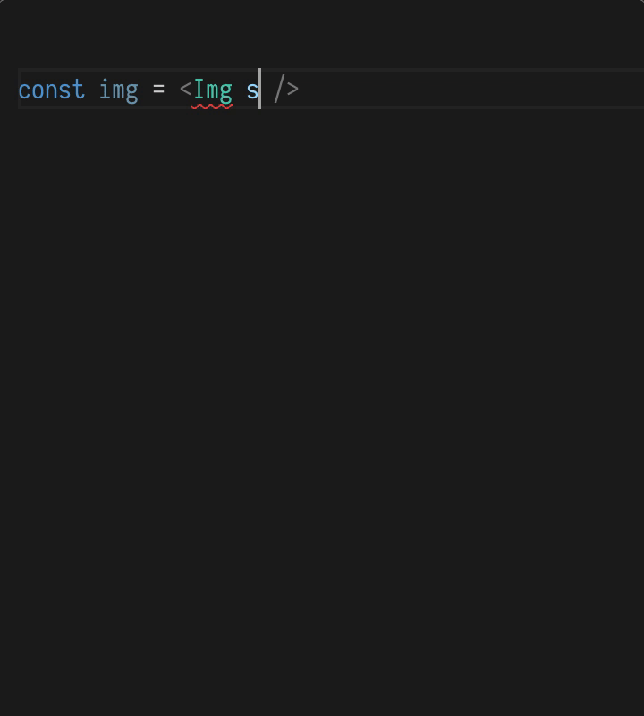

# iconista

- Hundreds of SVG icons in one React component
- Just [one 50-line component](https://github.com/streamich/iconista/blob/master/src/index.tsx)
- [See available icons](./sets)
- TypeScript autocompletion for icon sets and icons



React usage:

```js
import Img from 'iconista';


```

Or, simply get the icon URL:

```js
import {getUrl} from 'iconista/lib/getUrl';

const url = getUrl({set: 'ibm_16', icon: 'arrow--down'});
```


## License

- `elastic` icons set is under [Apache License 2.0 by Elastic](https://github.com/elastic/eui/blob/master/LICENSE)
- `ibm_16` and `ibm_32` icons sets are under [Apache License 2.0 by IBM](https://github.com/IBM/carbon-elements/blob/master/LICENSE)
- This project is under [Unlicense](LICENSE) license &mdash; public domain.
